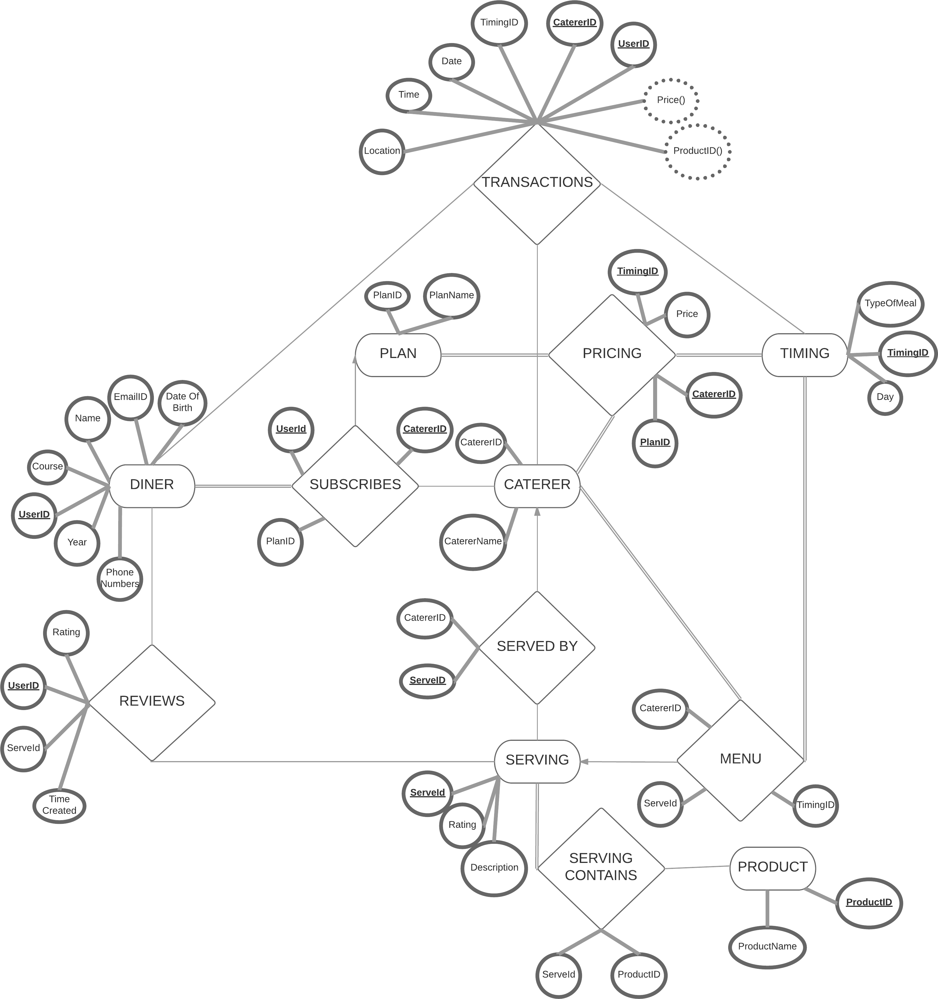

# A DBMS Solution for Catering in Colleges
Submitted by:
    * Arjun Srivastava : 160001007
    * Sahaj Khandelwal : 160001052
Project Guide: Mrs Aruna Tiwari

# Problem Statement 
We provide a solution to the vows of the people in IITI.
The current system includes a tedious task of verifying individual QR codes.
Our system proposes a method to turn it into transactions through the SmartCards,and hence in our solution, we make a PWA(Progressive Web Application),and change the payment method to SmartCards.

# PWA features
* Tell the user about upcoming meals.
    * Meal details 
    * Meal price
    * Meal rating
* Show meal history.
    * All the meals the user has had.
    * And how much it cost him/her.
* Subscriptions.
	* Show the diner all of his/hers subscriptions with the corresponding caterers.
* Reviews.
	* Every diner has the facility to rate the meal.

# Paument
* Payment Device
    * Will use the SmartCard to make a transaction. It will also provide the time and the caterer.

# Caterer
* Billing
    * We will provide the relevant transactions to the caterer.
    * He will deduct money monthly.

## User prerequisites  
Every student has to register with the system in order to be eligible to dine at the mess.
As a user registers, he/she provides - 
* Name 
* Date of birth 
* Year
* Course ( B.Tech/M.Tech/PhD/Guests)
* Subscription (Monthly/Daily/Semester)
* Email ID ( Multiple )
* Phone numbers ( Multiple )

## What the user wants
* Every time a diner goes to eat,they walk in and press their Smart card against the reader.
* The computer automatically detects the right amount, and it checks the following -
    * If the person has already had the meal today.
    * Their balance is enough.
    * What Subscription are they on.
* And then, on successful verification of the diner, the transaction is recorded, with instant calculation of the price.

## Caterer prerequisites 
* Every caterer has to register to the system and will obtain a unique CatererID.
* Then the caterer has to opt for the plans to be made available for subscription to the diners, along with the price details.
* The caterer then, has to list out the products,that will be available to be served,and hence, update the menu.
* The caterer will also notify about the timings at which the diners can avail the dining facilities.

## What the caterer wants 
* The caterer will have the access to the transactions made every time a diners avails the facility.
* The caterer is privileged with the facility of changing the pricing scheme, along with surge pricing.
* A caterer can also update the menu.

#### App Features
* Balance
* Menu
* How much you have paid.
* How many people are currently in the mess(tentatively).
* They get a notification on the app whenever they make a transaction.
* They are allowed to rate and review a meal. 
* They can also know the average rating of the meal before they even leave for it.
* It also shows the number of transactions made with each caterer,on an average basis(monthly),and hence, know which caterer is serving better. Similar stats and analytics will be displayed on the app.

# Entities

* Diner 
* Plan 
* Caterer 
* Product 
* Serving 
* Timing 

# Relations

* ServedBy   (Serving and caterer)
* ServingContains (Serving and Products)
* Reviews (Diner and Serving)
* Subscribes (Diner, Plan and Caterer)
* Menu (Timing and Serving)
* Pricing (Caterer , Timing and Plan)
* Transaction (Diner ,Caterer and Timing)

# The ER Diagram

# Tables

* Diner( <u> UserID </u>, Name, DOB, Year, Course)
* Email( UserID, <u> EmailID</u> )
* Phones(<u> UserID, PhoneNumber </u>)
* Plan (<u>PlanID</u>, PlanName )
* Caterer (<u>CatererID</u>, CatererName)
* Product (<u>ProductID</u>,ProductName, Price)
* Serving (<u>ServeID</u>, CatererID, Description, Rating)
* ServingContains(<u>ServeID, ProductID</u>)
* Timing (<u>TimingID</u>,Day,TypeOfMeal)
* Subscribes (<u>UserID,CatererID</u>, PlanID)
* Reviews (<u>ReviewID</u>, ServeID, UserID , Rating, TimeCreated)
* Menu (<u>TimingID,ServeID</u>)
* Pricing (<u>CatererID,PlanID,TimingID</u>, Price)
* Transaction (<u>UserID,CatererID,TimingID</u>, Date , Time, Location, ServeID, Price)

# Constraints And Functional Dependencies 

### Foreign Key Dependecies.
* Serving.CatererID references Caterer.CatererID

* ServingContains.ServeID references Serving.ServeID
* ServingContains.ProductID references Product.ProductID

* Subscribes.UserID references Diner.UserID
* Subscribes.CatererID references Caterer.CatererID
* Subscribes.PlanID references Plan.PlanID

* Reviews.UserID references Diner.UserID
* Reviews.ServeID references Serving.ServeID

* Menu.TimingID references Timing.TimingID
* Menu.ServeID references Serving.ServeID

* Pricing.CatererID references Caterer.CatererID
* Pricing.PlanID references Plan.PlanID
* Pricing.TimingID references Timing.TimingID  

* Transaction.UserID references Diner.UserID
* Transaction.CatererID references Caterer.CatererID
* Transaction.TimingID references Timing.TimingID
* Transaction.ServeID references Serving.ServeID

### Other Constraints
* The Caterer can only append to the tables,but can't delete the previously existing entries. (Serving), This will allow us to show
which serving was eaten even after the Menu changes.
* We will also calculate and insert price with the a transaction so that we don't have errors when the caterer updates the prices, later on.
* Serving will allow us to rate a dish by a caterer.
* 

* 
* 

